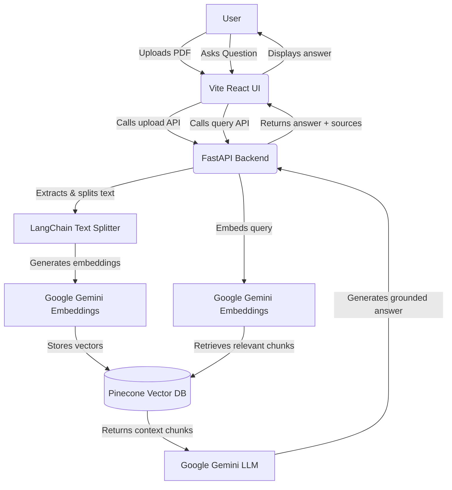

# ContextIQ

ContextIQ is a professional "Chat with PDF" Retrieval-Augmented Generation (RAG) app.
Upload a PDF, index it in Pinecone using Gemini embeddings, and ask questions with answers grounded in retrieved context.

## Architecture Overview



1. Upload a PDF in the React UI
2. Extract text and split into chunks (`RecursiveCharacterTextSplitter`)
3. Generate embeddings with Gemini
4. Store vectors in Pinecone
5. Embed the query and retrieve relevant chunks
6. Generate an answer strictly from the retrieved context

## Tech Stack

- React + Vite (UI)
- FastAPI (API backend)
- Google Gemini (LLM + embeddings)
- Pinecone (vector database)
- LangChain (chunking)
- PyPDF (PDF parsing)

## Setup

1. Install dependencies:

```bash
pip install -r requirements.txt
```

2. Create an environment file:

```bash
cp .env.example .env
```

3. Fill in the required values in `.env`:

- `GOOGLE_API_KEY`
- `PINECONE_API_KEY`
- `PINECONE_INDEX_NAME`

4. Run the backend API:

```bash
python main.py
```

5. Run the latest UI (Vite React app):

```bash
cd vite-ui
npm install
npm run dev
```

## Notes

- The app keeps only the latest uploaded PDF (vectors are stored in a single Pinecone namespace and overwritten on each upload).
- If no relevant context is found, the app will say it does not know.
