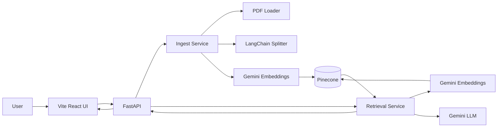
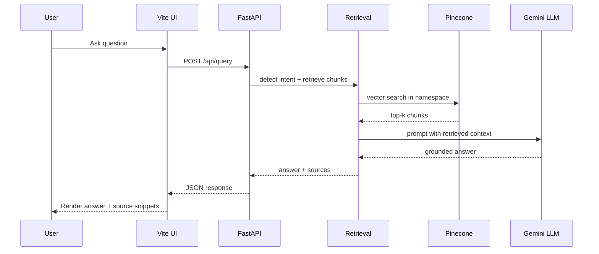

# ContextIQ

ContextIQ is a PDF Q&A RAG app.
It indexes a PDF into Pinecone with Gemini embeddings, then answers questions using only retrieved context.

## Architecture



## Query Flow



## Stack

- Backend: FastAPI, LangChain, Pinecone, Google Gemini
- Frontend: React + Vite
- Optional UI: Streamlit (`app.py`)

## Quick Start

1. Install backend deps:

```bash
pip install -r requirements.txt
```

2. Add environment values in `.env`:

- `GOOGLE_API_KEY`
- `PINECONE_API_KEY`
- `PINECONE_INDEX_NAME`

3. Run API:

```bash
python main.py
```

4. Run web UI:

```bash
cd vite-ui
npm install
npm run dev
```

## API Endpoints

- `GET /health` - health check
- `POST /api/upload` - upload and index a PDF (namespace: `latest`)
- `POST /api/query` - query indexed document and return `answer`, `sources`, `intent`

## Behavior Notes

- Upload replaces vectors in the `latest` namespace (single-document demo behavior).
- Retrieval depth is intent-aware (`summary`, `analysis`, `qa`).
- If context is insufficient, the answer is constrained by retrieved text.
