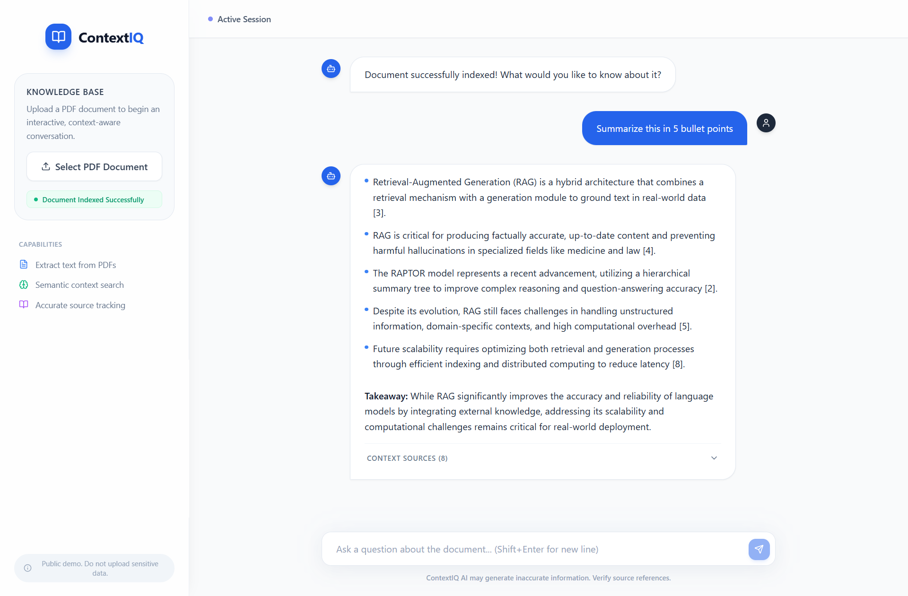
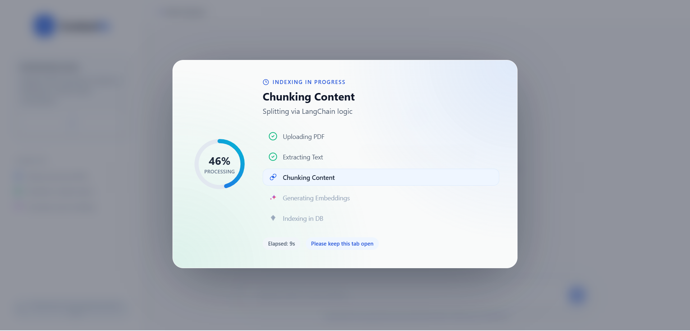
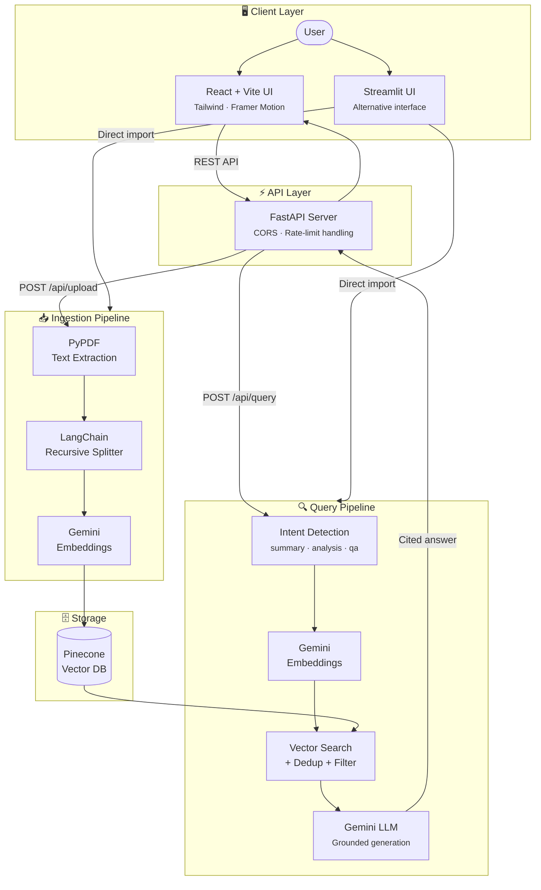
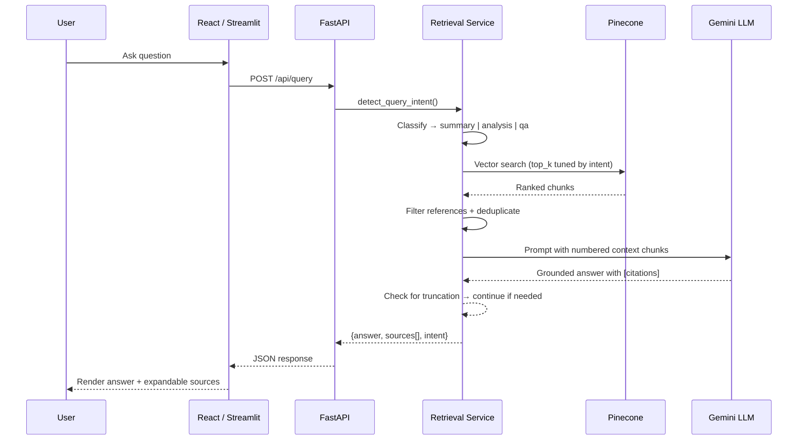

<p align="center">
  
</p>

<h1 align="center">ContextIQ</h1>

<p align="center">
  <strong>Ask your PDFs anything — get grounded, cited answers in seconds.</strong>
</p>

<p align="center">
  <a href="#quick-start"></a>
  <a href="#tech-stack"></a>
  <a href="#tech-stack"></a>
  <a href="#tech-stack"></a>
  <a href="LICENSE"></a>
</p>

---

## The Problem

Research papers are dense. Contracts are long. Technical docs pile up. You end up skimming, ctrl-F'ing, or re-reading pages you've already read — and still miss the point.

**ContextIQ** is a Retrieval-Augmented Generation (RAG) application that lets you upload a PDF and have a real conversation with it. Every answer is grounded in the actual document text, with inline citations so you can verify claims instantly — no hallucinations, no guessing.

---

## Demo

<p align="center">
  
</p>
<p align="center"><em>Chat interface — ask questions, get cited answers with expandable source context.</em></p>

<br />

<p align="center">
  
</p>
<p align="center"><em>Real-time indexing overlay — tracks each pipeline stage as your PDF is processed.</em></p>

---

## Key Features

- **Intent-Aware Retrieval** — Automatically classifies queries as `summary`, `analysis`, or `qa` and tunes retrieval depth (3–8 chunks) accordingly.
- **Reference Filtering** — Heuristically detects bibliography/reference chunks and excludes them from context (unless you explicitly ask about citations).
- **Citation Tracking** — Every answer includes `[1]`, `[2]` markers mapped to the exact source chunks, so you can verify claims.
- **Truncation Recovery** — If the LLM output is cut off mid-sentence, a continuation pass seamlessly finishes the answer.
- **Dual UI** — A polished React chat interface (Vite + Tailwind + Framer Motion) and an alternative Streamlit app, both powered by the same backend services.
- **Rate-Limit Resilience** — Automatic retry with exponential backoff for embedding API 429s; user-friendly error messages for quota exhaustion.

---

## Architecture


```mermaid
flowchart TB
    subgraph CLIENT["🖥️ Client Layer"]
        USER([User])
        REACT["React + Vite UI<br/><small>Tailwind · Framer Motion</small>"]
        STREAMLIT["Streamlit UI<br/><small>Alternative interface</small>"]
    end

    subgraph API_LAYER["⚡ API Layer"]
        FASTAPI["FastAPI Server<br/><small>CORS · Rate-limit handling</small>"]
    end

    subgraph INGEST["📥 Ingestion Pipeline"]
        direction LR
        PDF_LOAD["PyPDF<br/>Text Extraction"]
        SPLIT["LangChain<br/>Recursive Splitter"]
        EMB_I["Gemini<br/>Embeddings"]
    end

    subgraph QUERY["🔍 Query Pipeline"]
        direction LR
        INTENT["Intent Detection<br/><small>summary · analysis · qa</small>"]
        EMB_Q["Gemini<br/>Embeddings"]
        SEARCH["Vector Search<br/>+ Dedup + Filter"]
        LLM["Gemini LLM<br/><small>Grounded generation</small>"]
    end

    subgraph STORAGE["🗄️ Storage"]
        PINECONE[("Pinecone<br/>Vector DB")]
    end

    USER --> REACT
    USER --> STREAMLIT
    REACT -- "REST API" --> FASTAPI
    STREAMLIT -- "Direct import" --> INGEST
    STREAMLIT -- "Direct import" --> QUERY
    FASTAPI -- "POST /api/upload" --> PDF_LOAD
    PDF_LOAD --> SPLIT --> EMB_I --> PINECONE
    FASTAPI -- "POST /api/query" --> INTENT
    INTENT --> EMB_Q --> SEARCH
    PINECONE --> SEARCH
    SEARCH --> LLM
    LLM -- "Cited answer" --> FASTAPI
    FASTAPI --> REACT
```

## Query Flow


```mermaid
sequenceDiagram
    participant U as User
    participant UI as React / Streamlit
    participant API as FastAPI
    participant R as Retrieval Service
    participant P as Pinecone
    participant G as Gemini LLM

    U->>UI: Ask question
    UI->>API: POST /api/query
    API->>R: detect_query_intent()
    R->>R: Classify → summary | analysis | qa
    R->>P: Vector search (top_k tuned by intent)
    P-->>R: Ranked chunks
    R->>R: Filter references + deduplicate
    R->>G: Prompt with numbered context chunks
    G-->>R: Grounded answer with [citations]
    R-->>R: Check for truncation → continue if needed
    R-->>API: {answer, sources[], intent}
    API-->>UI: JSON response
    UI-->>U: Render answer + expandable sources
```

---

## Tech Stack

| Layer | Technology | Role |
|---|---|---|
| **LLM** | Google Gemini 2.5 Flash | Answer generation with grounded context |
| **Embeddings** | Gemini Embedding 001 | Semantic vectorization of text chunks |
| **Vector DB** | Pinecone (Serverless) | Cosine-similarity search over embeddings |
| **Chunking** | LangChain `RecursiveCharacterTextSplitter` | Splits PDF text into overlapping 1000-char chunks |
| **PDF Parsing** | PyPDF | Raw text extraction from uploaded PDFs |
| **Backend** | FastAPI + Uvicorn | REST API with CORS, file upload, error handling |
| **Frontend** | React 18 + Vite + TypeScript | Chat interface with Framer Motion animations |
| **Styling** | Tailwind CSS 3 | Utility-first responsive design |
| **Alt UI** | Streamlit | Standalone single-file app for quick demos |
| **Env Management** | python-dotenv | `.env`-based secret management |

---

## Project Structure

```
contextiq-rag/
├── main.py                  # FastAPI entry point (uvicorn server)
├── app.py                   # Streamlit alternative UI
├── requirements.txt         # Python dependencies
├── runtime.txt              # Python version for deployment
├── .env.example             # Template for required env vars
├── .gitignore
├── LICENSE
│
├── services/
│   ├── embeddings.py        # Gemini embedding client + retry logic
│   ├── ingest.py            # PDF → chunk → embed → Pinecone upsert
│   └── retrieval.py         # Intent detection, vector search, LLM generation
│
├── utils/
│   └── pdf_loader.py        # PyPDF text extraction
│
├── assets/
│   ├── contextiq-logo.svg   # App logo
│   ├── screenshot-chat.png  # Chat UI screenshot
│   └── screenshot-indexing.png  # Indexing overlay screenshot
│
└── vite-ui/                 # React frontend
    ├── index.html
    ├── package.json
    ├── vite.config.ts
    ├── tailwind.config.js
    └── src/
        ├── main.tsx
        ├── App.tsx           # Full chat application component
        ├── App.css
        └── index.css
```

---

## Quick Start

### Prerequisites

- **Python 3.11+** — [Download](https://www.python.org/downloads/)
- **Node.js 18+** — [Download](https://nodejs.org/) (for the React UI)
- **Google AI API Key** — [Get one free](https://aistudio.google.com/apikey)
- **Pinecone API Key** — [Sign up free](https://www.pinecone.io/)

### 1. Clone the repo

```bash
git clone https://github.com/Diluksha-Upeka/contextiq-rag.git
cd contextiq-rag
```

### 2. Set up environment variables

```bash
cp .env.example .env
```

Open `.env` and fill in your API keys:

```env
GOOGLE_API_KEY=your_google_api_key
PINECONE_API_KEY=your_pinecone_api_key
PINECONE_INDEX_NAME=second-brain-rag
PINECONE_CLOUD=aws
PINECONE_REGION=us-east-1
EMBEDDING_DIM=768
```

### 3. Install Python dependencies

```bash
pip install -r requirements.txt
```

### 4. Start the FastAPI backend

```bash
python main.py
```

The API server starts at `http://localhost:8000`. Verify with:

```bash
curl http://localhost:8000/health
# → {"status": "ok"}
```

### 5. Start the React frontend

```bash
cd vite-ui
npm install
npm run dev
```

Open `http://localhost:5173` in your browser.

### Alternative: Streamlit UI

If you prefer a simpler interface without the React setup:

```bash
streamlit run app.py
```

---

## API Reference

| Method | Endpoint | Description |
|---|---|---|
| `GET` | `/health` | Health check — returns `{"status": "ok"}` |
| `POST` | `/api/upload` | Upload a PDF file for indexing. Extracts text, chunks, embeds, and upserts to Pinecone. Returns `{"message": "...", "namespace": "latest"}` |
| `POST` | `/api/query` | Query the indexed document. Accepts `{"query": "...", "namespace": "latest"}`. Returns `{"answer": "...", "sources": [...], "intent": "qa"}` |

### Example: Query a document

```bash
curl -X POST http://localhost:8000/api/query \
  -H "Content-Type: application/json" \
  -d '{"query": "What are the main findings?", "namespace": "latest"}'
```

---

## Behavior Notes

- **Single-document demo** — Upload replaces all vectors in the `latest` namespace. For multi-document support, modify the namespace logic in `ingest.py`.
- **Intent-aware depth** — `summary` fetches 8 chunks, `analysis` fetches 5, `qa` fetches 3 for focused answers.
- **Reference exclusion** — Bibliography-heavy chunks are automatically filtered out unless your query is about citations or references.
- **Grounded answers** — The LLM is constrained to answer using only retrieved context. If context is insufficient, it says so rather than hallucinating.

---

## License

This project is licensed under the [MIT License](LICENSE).
